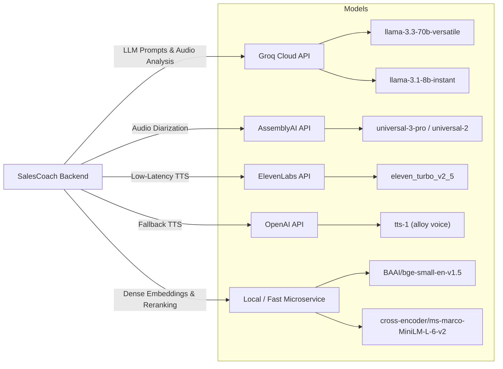
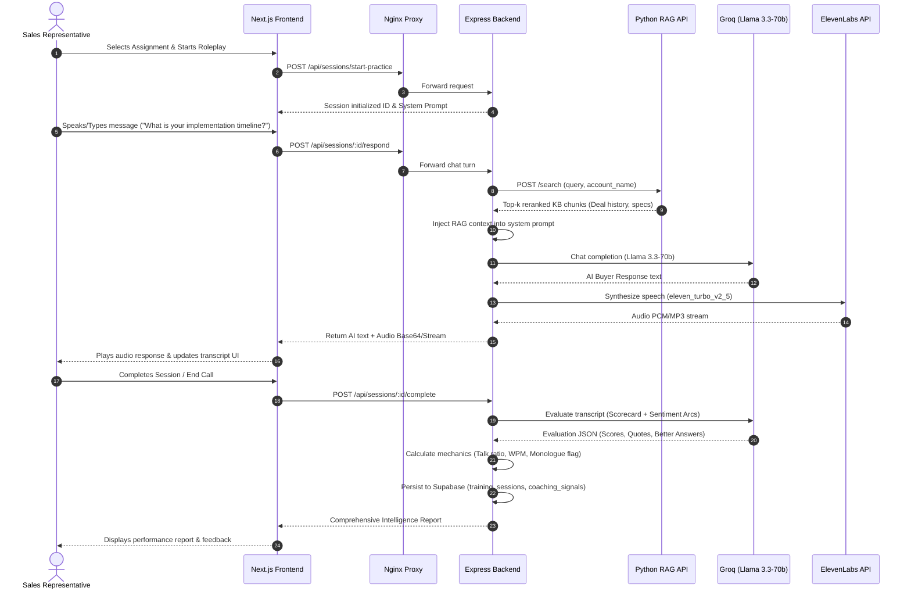

# SalesCoach AI: Comprehensive System Architecture & Feature Explanation

This document provides an exhaustive, technical, and architectural breakdown of the **SalesCoach AI** platform. It details how the overall system is structured, how each feature works end-to-end, how components are connected, what tools power the backend, and which external AI models/services are integrated.

---

## 📐 1. System Overview & Architecture Diagram

SalesCoach AI is designed as a microservice-oriented, event-driven platform split across a Next.js frontend, an Express Node.js backend orchestration engine, a Python FastAPI RAG (Retrieval-Augmented Generation) microservice, and a Python FastAPI Voice-AI prosody analyzer.

```mermaid
graph TD
    subgraph Client ["Frontend (Next.js 14 App Router)"]
        UI_Rep["Rep Workspace & Live Simulator"]
        UI_Mgr["Manager Command Center & Analytics"]
    end

    subgraph Proxy ["Reverse Proxy"]
        Nginx["Nginx Reverse Proxy (Port 80/443)"]
    end

    subgraph Backend ["Backend Node.js Service (Port 4000)"]
        Express["Express.js App Router"]
        Secrets["AWS Secrets Manager / TTL Cache"]
        Metrics["Behavioral Metrics Engine"]
        PromptGen["System Prompt & Dynamic Context Generator"]
        EvalEngine["AI Scorecard & Analytics Evaluator"]
    end

    subgraph RAG_Service ["RAG Microservice (Python FastAPI - Port 8001)"]
        FastAPI_RAG["RAG API Endpoint"]
        Embedder["BAAI/bge-small-en-v1.5 Embedder"]
        Reranker["ms-marco-MiniLM-L-6-v2 Cross-Encoder"]
    end

    subgraph Voice_Service ["Voice-AI Microservice (Python FastAPI)"]
        Parselmouth["Parselmouth & Librosa Signal Processor"]
    end

    subgraph Storage ["Database & Vector Store"]
        SupaDB["Supabase PostgreSQL Database"]
        PgVector["Supabase pgvector (document_embeddings)"]
    end

    subgraph External_AI ["External AI Services"]
        Groq["Groq API (Llama 3.3-70b / Llama 3.1)"]
        ElevenLabs["ElevenLabs API (eleven_turbo_v2_5)"]
        AssemblyAI["AssemblyAI API (universal-3-pro)"]
        OpenAI["OpenAI API (tts-1 Fallback)"]
    end

    UI_Rep -->|HTTP / Audio Base64| Nginx
    UI_Mgr -->|HTTP / REST| Nginx
    Nginx -->|Proxy /api| Express
    
    Express -->|Secrets Fetch| Secrets
    Express -->|RAG Search /search| FastAPI_RAG
    Express -->|Voice Analysis /analyze-voice| Parselmouth
    Express -->|CRUD & Auth| SupaDB
    
    FastAPI_RAG -->|Vector Search| PgVector
    FastAPI_RAG -->|Dense Embedding| Embedder
    FastAPI_RAG -->|Semantic Re-ranking| Reranker

    Express -->|LLM Chat & Evaluation| Groq
    Express -->|Voice Synthesis TTS| ElevenLabs
    Express -->|Audio Persona Extraction| AssemblyAI
    Express -->|TTS Fallback| OpenAI
```

---

## 🔗 2. System Components & How They Are Connected

1. **Frontend ([frontend](file:///c:/Users/Relanto/SalesCoach_version/AI-T/AI-T/frontend))**: Built with **Next.js 14 (App Router)** and TypeScript. It presents two primary user views:
   - **Manager Dashboard**: Scenario creation, bulk training assignment, team analytics, rep proficiency matrix, coaching notes, and call upload.
   - **Rep Workspace**: Active training missions, interactive voice/text simulation engine, historical practice reports, personal skill radar, and study guides.

2. **Nginx Reverse Proxy ([nginx](file:///c:/Users/Relanto/SalesCoach_version/AI-T/AI-T/nginx))**: Routes incoming HTTP requests to internal Docker containers:
   - Port `3000` $\rightarrow$ Next.js Frontend
   - Port `4000` $\rightarrow$ Node.js Express Backend
   - Port `8001` $\rightarrow$ Python RAG FastAPI Service

3. **Backend API ([backend](file:///c:/Users/Relanto/SalesCoach_version/AI-T/AI-T/backend))**: Node.js & Express server written in TypeScript. Functions as the core orchestrator:
   - Manages authentication (JWT + Supabase Auth) and role-based authorization.
   - Intersects live chat requests, queries the RAG service for domain context, constructs system prompts, and handles Groq LLM streaming/completion.
   - Proxies TTS synthesis requests to ElevenLabs / OpenAI.
   - Runs post-session AI evaluation, tone profiling, and mechanics calculations.

4. **RAG Microservice ([rag](file:///c:/Users/Relanto/SalesCoach_version/AI-T/AI-T/rag))**: Python FastAPI service running at port 8001:
   - Exposes `/search` and `/accounts` endpoints.
   - Uses `EmbedderSingleton` (`BAAI/bge-small-en-v1.5`) and `SupabaseVectorStore` / `pgvector` for similarity retrieval.
   - Employs a cross-encoder reranker (`CrossEncoder("cross-encoder/ms-marco-MiniLM-L-6-v2")`) to re-score top candidate chunks before returning them to the Express backend.

5. **Voice-AI Sidecar ([voice-ai](file:///c:/Users/Relanto/SalesCoach_version/AI-T/AI-T/voice-ai))**: Python FastAPI service:
   - Evaluates acoustic audio files uploaded during vocal turns using `librosa` and `parselmouth`.
   - Computes fundamental frequency (pitch mean/std/range), energy levels, speaking duration, and pause/hesitation ratios.

6. **Database & Vector Store**: Supabase PostgreSQL hosting relational tables (`users`, `training_scenarios`, `training_assignments`, `training_sessions`, `calls`, `coaching_signals`) and `document_embeddings` for vector search.

---

## 🛠️ 3. Detailed Feature Breakdown & Workflow Execution

### Feature 1: AI Persona & Scenario Creation
* **File References**: 
  - Controller: [`scenarioController.ts`](file:///c:/Users/Relanto/SalesCoach_version/AI-T/AI-T/backend/controllers/scenarioController.ts)
  - Audio Persona Extractor: [`personaController.ts`](file:///c:/Users/Relanto/SalesCoach_version/AI-T/AI-T/backend/controllers/personaController.ts)
  - Prompt Builder: [`promptGenerator.ts`](file:///c:/Users/Relanto/SalesCoach_version/AI-T/AI-T/backend/utils/promptGenerator.ts)
* **How It Works**:
  1. **Manual Creation**: Managers specify buyer persona details (name, title, company, personality traits, objection style, difficulty level, evaluation focus, custom prompt, and custom dynamic scorecard metrics).
  2. **Audio-Driven Persona Generation**: Managers can upload a real sales call recording. The backend sends the file to **AssemblyAI** (`universal-3-pro`) for multi-speaker diarized transcription (`Speaker A / Speaker B`). The transcript is sent to **Groq** (`llama-3.3-70b-versatile`), which extracts prospect behavior, personality traits, objection style, decision drivers, and automatically generates tailored evaluation questions.
  3. **System Prompt Construction**: [`generateSystemInstruction`](file:///c:/Users/Relanto/SalesCoach_version/AI-T/AI-T/backend/utils/promptGenerator.ts#L15-L73) compiles identity details, established account context, difficulty level, and strict conversational rules (e.g. 1-3 sentences max, natural pacing, gradual information disclosure).

---

### Feature 2: Training Assignment Lifecycle Management
* **File Reference**: [`assignmentController.ts`](file:///c:/Users/Relanto/SalesCoach_version/AI-T/AI-T/backend/controllers/assignmentController.ts)
* **How It Works**:
  1. Managers select a scenario and bulk assign it to sales reps.
  2. Configuration options include: Training Mode (`Coach Mode`, `Exam Mode`, `Learning Mode`), Priority (`Low`, `Medium`, `High`), Deadlines, Representative Avatar Selection (`female` / `male`), and Coaching Notes.
  3. When a Rep logs in, their workspace filters active assignments, status (`Pending`, `In Progress`, `Completed`, `Overdue`), and allows immediate entry into the simulation engine.

---

### Feature 3: Interactive Live Simulation Engine (Voice & Text)
* **File References**: 
  - Session Handler: [`sessionController.ts`](file:///c:/Users/Relanto/SalesCoach_version/AI-T/AI-T/backend/controllers/sessionController.ts)
  - RAG Client: [`ragClient.ts`](file:///c:/Users/Relanto/SalesCoach_version/AI-T/AI-T/backend/utils/ragClient.ts)
  - Speech Synthesis: [`ttsController.ts`](file:///c:/Users/Relanto/SalesCoach_version/AI-T/AI-T/backend/controllers/ttsController.ts)
* **How It Works**:
  1. **User Turn**: The rep types or speaks a message. If spoken, browser audio is sent or processed.
  2. **RAG Context Retrieval**: The backend calls the Python RAG microservice at `http://localhost:8001/search` with the rep's input and account slug (`account_name`). The top reranked chunks from deal history, previous meeting notes, or technical specs are formatted by [`formatRagContext`](file:///c:/Users/Relanto/SalesCoach_version/AI-T/AI-T/backend/utils/ragClient.ts#L66-L81) and injected into the LLM system prompt.
  3. **LLM Generation**: The backend invokes **Groq** (`llama-3.3-70b-versatile` / `llama-3.1-8b-instant`) to generate the buyer's response in real-time.
  4. **Voice Synthesis (TTS)**: The AI's text response is sent to [`synthesizeSpeech`](file:///c:/Users/Relanto/SalesCoach_version/AI-T/AI-T/backend/controllers/ttsController.ts#L8-L101). It streams audio from **ElevenLabs** API v1 (`eleven_turbo_v2_5`) using chosen voice IDs. If ElevenLabs is unavailable, it gracefully falls back to **OpenAI TTS** (`model: tts-1`, `voice: alloy`).

---

### Feature 4: Multi-Layer AI Evaluation & Analytics Engine
* **File Reference**: [`evaluationGenerator.ts`](file:///c:/Users/Relanto/SalesCoach_version/AI-T/AI-T/backend/utils/evaluationGenerator.ts)
* **How It Works**:
  Upon session completion, the backend triggers dual AI evaluations via Groq:
  1. **Scorecard & Tactical Evaluation**: Evaluates the rep against custom per-persona metrics or standard 6 categories (*Communication & Professionalism*, *Customer Understanding*, *Active Listening & Engagement*, *Value Communication*, *Objection & Concern Handling*, *Next Steps & Call Effectiveness*).
     - **Strict Evidence Rules**: Scores 0 for unobserved skills.
     - **Verbatim Evidence**: Extracts exact rep quotes (`actual_answer`) and generates first-person rep improvements (`better_answer`).
  2. **Conversation Analytics**: Analyzes emotional dynamics, producing:
     - **Rep Tone Profile**: Scores for professional, friendly, confident, empathetic, calm, aggressive, passive.
     - **Sentiment Arcs**: Step-by-step sentiment tracking for both Customer and Rep across every conversation turn.

---

### Feature 5: Behavioral Mechanics & Call Analytics Engine
* **File References**:
  - Mechanics Calculator: [`metricsEngine.ts`](file:///c:/Users/Relanto/SalesCoach_version/AI-T/AI-T/backend/services/metricsEngine.ts)
  - Real-time Mechanics: [`mechanicsCalculator.ts`](file:///c:/Users/Relanto/SalesCoach_version/AI-T/AI-T/backend/utils/mechanicsCalculator.ts)
  - Call Upload Controller: [`callController.ts`](file:///c:/Users/Relanto/SalesCoach_version/AI-T/AI-T/backend/controllers/callController.ts)
* **How It Works**:
  1. **Transcript Parsing**: Parses speaker turns (`Rep:` vs `Customer:`).
  2. **Quantitative Calculations**:
     - **Talk Ratio**: $(\text{Rep Words} / \text{Total Words}) \times 100$
     - **Question Rate**: $(\text{Rep Question Sentences} / \text{Total Rep Sentences}) \times 100$
     - **Interactivity Score**: $(\text{Rep Turns } < 20 \text{ Words} / \text{Total Rep Turns}) \times 100$
     - **Monologue Flag**: Triggers if any single rep turn exceeds 180 words.
  3. **CSV Call Ingestion**: Managers can batch upload historical call transcripts via CSV. The engine validates rows, links rep emails, inserts call records, and automatically calculates and stores metrics in `coaching_signals`.

---

### Feature 6: Manager Intelligence Command Center & AI Study Guides
* **File References**:
  - Manager Dashboard Controller: [`dashboardController.ts`](file:///c:/Users/Relanto/SalesCoach_version/AI-T/AI-T/backend/controllers/dashboardController.ts)
  - Coaching Controller: [`coachingController.ts`](file:///c:/Users/Relanto/SalesCoach_version/AI-T/AI-T/backend/controllers/coachingController.ts)
* **How It Works**:
  1. **Team Analytics**: Visualizes skill matrices, rep completion rates, risk flags, and aggregate metrics across scenarios.
  2. **AI Study Guide Generator**: Managers can trigger [`generateStudyGuide`](file:///c:/Users/Relanto/SalesCoach_version/AI-T/AI-T/backend/controllers/coachingController.ts#L35-L80) for any rep. Groq creates a 5-step personalized guide leveraging the rep's top strength to overcome their lowest skill gap.

---

### Feature 7: Knowledge Base & RAG Ingestion Pipeline
* **File References**:
  - RAG Architecture: [`rag/`](file:///c:/Users/Relanto/SalesCoach_version/AI-T/AI-T/rag)
  - Connector Scripts: [`scaffold_hubspot.py`](file:///c:/Users/Relanto/SalesCoach_version/AI-T/AI-T/scaffold_hubspot.py), [`scaffold_rag.py`](file:///c:/Users/Relanto/SalesCoach_version/AI-T/AI-T/scaffold_rag.py), [`ingest_to_supabase.py`](file:///c:/Users/Relanto/SalesCoach_version/AI-T/AI-T/ingest_to_supabase.py)
* **How It Works**:
  1. Integrates account documents, deal histories, call transcripts, and HubSpot CRM data.
  2. Chunks documents into 700-character blocks with 120-character overlap.
  3. Embeds content using `BAAI/bge-small-en-v1.5` into Supabase `document_embeddings`.
  4. At query time, retrieves candidate vectors and passes them through `ms-marco-MiniLM-L-6-v2` cross-encoder for high-precision context injection.

---

## 🧰 4. Backend Tools & Infrastructure Stack

| Category | Tools / Libraries | Purpose & Usage in Backend |
| :--- | :--- | :--- |
| **Runtime & Language** | **Node.js** (v18+) & **TypeScript** | Express REST API server, controller logic, type safety. |
| **Framework** | **Express.js** | Handling REST API routes, middlewares (`auth`, `multer`). |
| **Database ORM/SDK** | `@supabase/supabase-js` | PostgreSQL operations, auth token verification, vector DB calls. |
| **Secrets Management** | `@aws-sdk/client-secrets-manager` | Dynamic AWS secret fetching with a 5-minute TTL cache in [`secrets.ts`](file:///c:/Users/Relanto/SalesCoach_version/AI-T/AI-T/backend/lib/secrets.ts). Fallbacks to `.env`. |
| **File Processing** | `multer` & `csv-parse` | Multipart form audio uploads & bulk CSV call parsing in [`callController.ts`](file:///c:/Users/Relanto/SalesCoach_version/AI-T/AI-T/backend/controllers/callController.ts). |
| **Python Microservice Framework** | **FastAPI** & **Uvicorn** | REST API wrappers for RAG pipeline (`port 8001`) and Voice-AI prosody analyzer. |
| **Acoustic Signal Processing** | `librosa` & `praat-parselmouth` | Signal processing in Python for pitch range, energy RMS, pause ratio, and duration. |
| **Containerization & Deployment** | **Docker**, **Docker Compose**, **Nginx** | Multi-container setup, environment isolation, reverse proxy routing, AWS CloudWatch logging. |

---

## 🤖 5. External AI Tools, Models & API Connections

### Detailed AI Model Reference Table

| External AI Provider | Model / API Name | Exact Role in SalesCoach Platform | File Location |
| :--- | :--- | :--- | :--- |
| **Groq Cloud API** | `llama-3.3-70b-versatile` | Real-time buyer persona dialogue generation, dynamic question generation, multi-criteria session evaluation, persona extraction from transcript, and study guide generation. | [`sessionController.ts`](file:///c:/Users/Relanto/SalesCoach_version/AI-T/AI-T/backend/controllers/sessionController.ts), [`questionController.ts`](file:///c:/Users/Relanto/SalesCoach_version/AI-T/AI-T/backend/controllers/questionController.ts), [`coachingController.ts`](file:///c:/Users/Relanto/SalesCoach_version/AI-T/AI-T/backend/controllers/coachingController.ts), [`personaController.ts`](file:///c:/Users/Relanto/SalesCoach_version/AI-T/AI-T/backend/controllers/personaController.ts) |
| **Groq Cloud API** | `llama-3.1-8b-instant` | Fast, low-latency conversational responses during high-speed roleplay turns. | [`sessionController.ts`](file:///c:/Users/Relanto/SalesCoach_version/AI-T/AI-T/backend/controllers/sessionController.ts) |
| **ElevenLabs API (v1)** | `eleven_turbo_v2_5` | High-fidelity, natural text-to-speech synthesis generating PCM/MP3 audio streams for persona speech output. | [`ttsController.ts`](file:///c:/Users/Relanto/SalesCoach_version/AI-T/AI-T/backend/controllers/ttsController.ts) |
| **AssemblyAI API** | `universal-3-pro` / `universal-2` | Multi-speaker diarized speech-to-text transcription used in automated persona extraction from uploaded sales call recordings. | [`personaController.ts`](file:///c:/Users/Relanto/SalesCoach_version/AI-T/AI-T/backend/controllers/personaController.ts) |
| **OpenAI API** | `tts-1` (Alloy Voice) | Automated fail-safe fallback for speech synthesis if ElevenLabs quotas or API limits are reached. | [`ttsController.ts`](file:///c:/Users/Relanto/SalesCoach_version/AI-T/AI-T/backend/controllers/ttsController.ts) |
| **HuggingFace / SentenceTransformers** | `BAAI/bge-small-en-v1.5` | Dense vector embedding model for indexing and retrieving deal history and account knowledge base chunks. | [`rag/embeddings/embedder.py`](file:///c:/Users/Relanto/SalesCoach_version/AI-T/AI-T/rag/embeddings/embedder.py) |
| **SentenceTransformers** | `cross-encoder/ms-marco-MiniLM-L-6-v2` | Cross-encoder reranking model that scores and filters retrieved knowledge chunks for maximum relevance before prompt injection. | [`rag/retrieval/reranker.py`](file:///c:/Users/Relanto/SalesCoach_version/AI-T/AI-T/rag/retrieval/reranker.py) |

---

## ⚡ 6. End-to-End Execution Sequence Flow

---
*Documented for engineering, architectural, and evaluation reference.*
